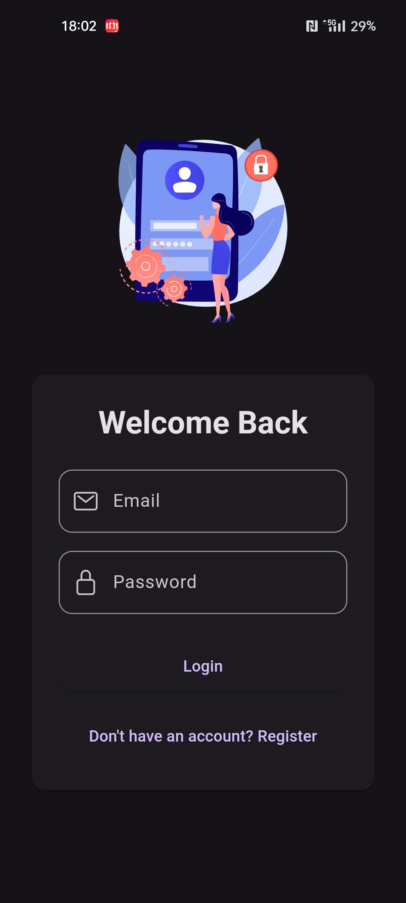
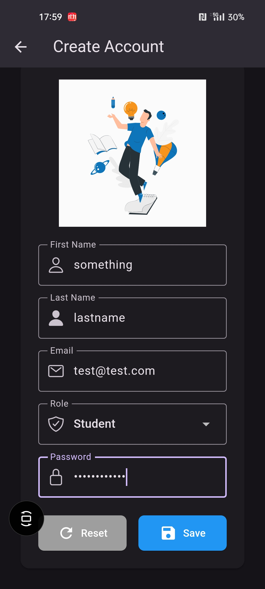
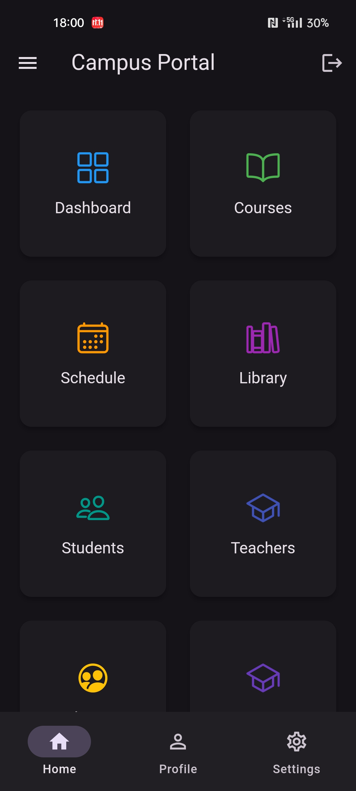
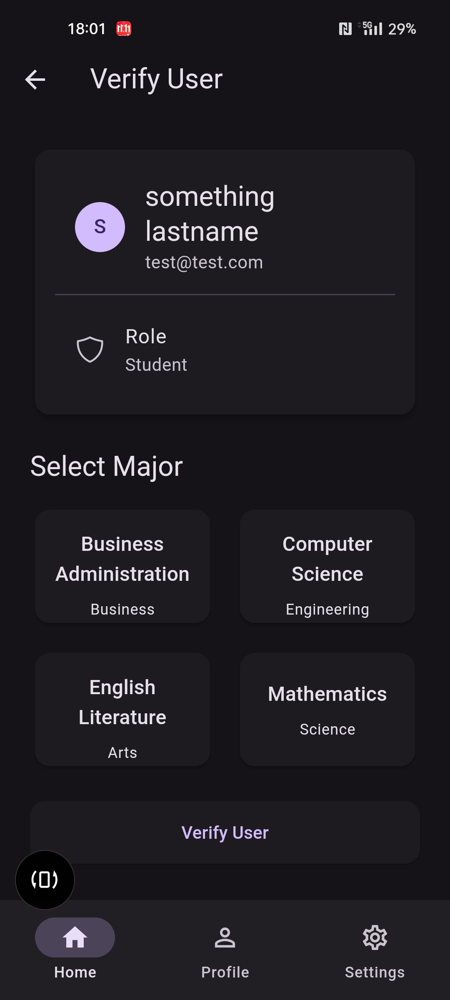
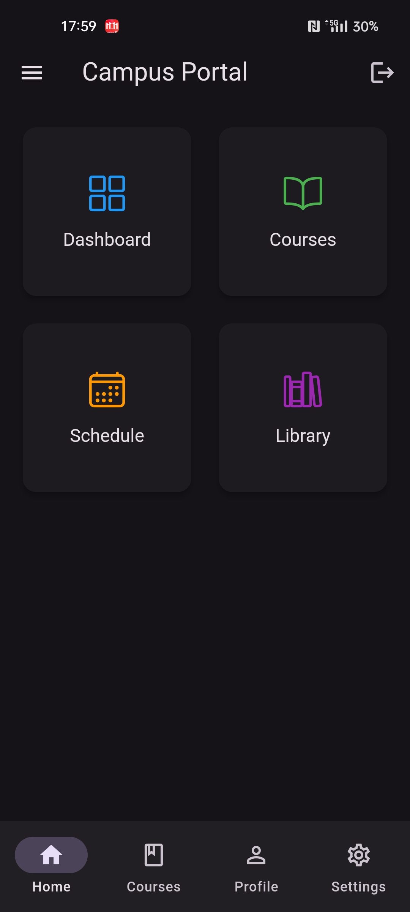
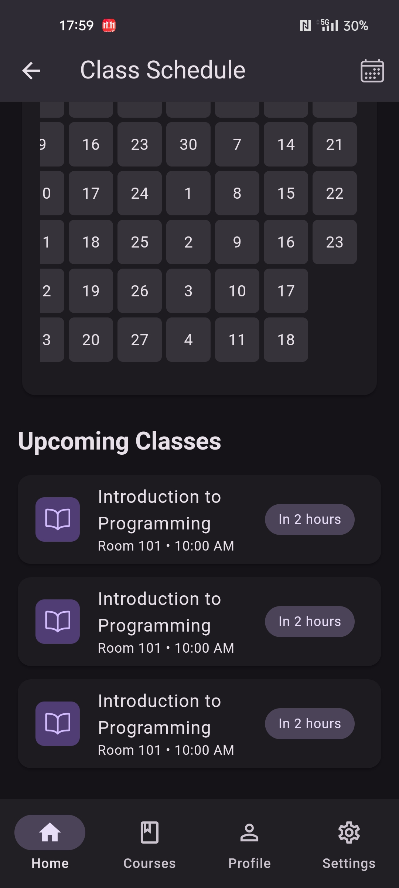
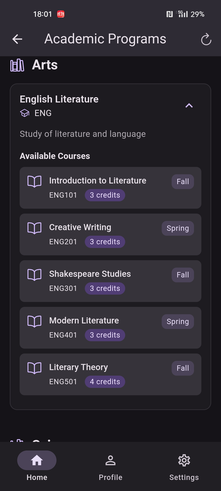
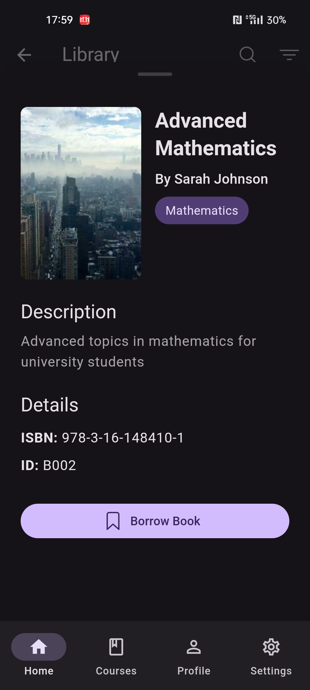
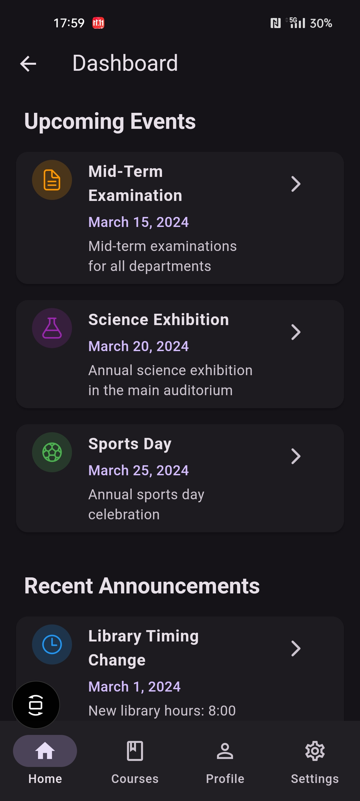

# 🎓 Campus Portal System - Flutter & Firebase University Management Platform

<div align="center">

[](https://flutter.dev/)
[](https://firebase.google.com/)
[](https://dart.dev/)
[](https://www.sqlite.org/)

[](https://opensource.org/licenses/MIT)
[](https://flutter.dev/)
[](https://github.com/yourusername/campus_portal_system)

**🚀 A Comprehensive Cross-Platform Campus Management Solution Built with Flutter & Firebase**

*Modern university administration system featuring real-time data synchronization, role-based authentication, and responsive design across all platforms*

[Features](#features) • [Screenshots](#screenshots) • [Tech Stack](#tech-stack) • [Installation](#installation) • [Architecture](#architecture)

</div>

---

## 📖 Overview

Campus Portal System is a modern, multiplatform application designed to streamline campus operations for administrators, teachers, and students. Built with Flutter for cross-platform compatibility and Firebase for real-time data synchronization, this system provides a comprehensive solution for educational institution management.

### 🎯 Key Highlights

- **🔄 Cross-Platform**: Native performance on Android, iOS, Web, Windows, macOS, and Linux
- **🔐 Role-Based Authentication**: Secure login system with Admin, Teacher, and Student roles
- **📊 Real-Time Dashboard**: Live data updates powered by Firebase
- **📚 Library Management**: Complete book catalog and borrowing system
- **🎨 Modern UI/UX**: Material Design 3 with dark/light theme support
- **📱 Responsive Design**: Optimized for all screen sizes and devices

## ✨ Features

### 🔐 Authentication & Authorization
- User registration with role selection (Admin/Teacher/Student)
- Secure Firebase Authentication integration
- Persistent login state with shared preferences
- Role-based access control and permissions
- User verification system for new registrations

### 👨‍💼 Admin Dashboard
- ✅ Verify and manage new user registrations
- 👥 Comprehensive teacher and student management
- 📋 Course assignment and scheduling
- 📚 Library resource management and monitoring
- 📊 System activity tracking and analytics
- 🏫 Department and major organization

### 👨‍🏫 Teacher Features
- 📚 View and manage assigned courses
- 👨‍🎓 Access detailed student information
- 📝 Course material management
- ✅ Student attendance tracking
- 📊 Grade management and reporting
- 🏢 Department-specific information access

### 👨‍🎓 Student Features
- 📖 View enrolled courses and schedules
- 📄 Access course materials and resources
- 🎯 Grade tracking and academic progress
- 📚 Library book borrowing system
- 📅 Academic calendar and events
- 📊 Personal dashboard with analytics

### 📚 Library Management
- 📖 Complete book catalog with search functionality
- 🔄 Borrowing and return system
- 🔍 Advanced book search and filtering
- 📊 Borrowing history and analytics
- 📅 Due date tracking and notifications

## 📱 App Showcase

### 🚀 Authentication & Onboarding
<div align="center">



*Secure authentication with role-based registration system*
</div>

---

### 👨‍💼 Admin Experience
<div align="center">



*Comprehensive admin controls with user management and verification*
</div>

---

### 👨‍🎓 Student Portal
<div align="center">



*Personalized student dashboard with academic calendar integration*
</div>

---

### 📚 Academic Management
<div align="center">




*Complete academic ecosystem with courses, library, and events*
</div>

---

<div align="center">

### 🎨 Modern UI Design
*Built with Material Design 3 principles, featuring smooth animations, responsive layouts, and intuitive navigation across all platforms*

[🔗 **View Live Demo**](https://your-demo-link.com) | [📱 **Download APK**](https://github.com/yourusername/campus_portal_system/releases)

</div>

## 🛠️ Tech Stack

### Frontend & Framework
 **Flutter** - Cross-platform UI framework
 **Dart** - Programming language

### Backend & Database
 **Firebase** - Backend-as-a-Service platform
 **Firestore** - NoSQL cloud database
 **SQLite** - Local database storage

### State Management & Navigation
- **Flutter Riverpod** (`^2.5.3`) - Advanced state management
- **Go Router** (`^13.2.0`) - Declarative routing

### UI & Design
- **Material Design 3** - Modern design system
- **Lottie** (`^3.1.3`) - Beautiful animations
- **Ionicons** (`^0.2.2`) - Comprehensive icon set
- **Glassmorphism** (`^3.0.0`) - Modern glass effects
- **Custom Poppins Font** - Typography

### Additional Features
- **Responsive Framework** (`^1.5.1`) - Multi-screen support
- **Flutter Animate** (`^4.5.0`) - Advanced animations
- **Heatmap Calendar** (`^1.0.5`) - Data visualization
- **HTTP** (`^1.1.0`) - API communication

## 🚀 Installation

### Prerequisites
- Flutter SDK (3.5.3 or higher)
- Dart SDK
- Firebase CLI
- Android Studio / VS Code
- Git

### Setup Instructions

1. **Clone the Repository**
```bash
git clone https://github.com/yourusername/campus_portal_system.git
cd campus_portal_system
```

2. **Install Dependencies**
```bash
flutter pub get
```

3. **Firebase Configuration**
```bash
# Install Firebase CLI
npm install -g firebase-tools

# Login to Firebase
firebase login

# Initialize Firebase (if not already configured)
firebase init
```

4. **Platform Setup**

**For Android:**
```bash
flutter build apk --release
```

**For iOS:**
```bash
flutter build ios --release
```

**For Web:**
```bash
flutter build web --release
```

**For Desktop:**
```bash
# Windows
flutter build windows --release

# macOS
flutter build macos --release

# Linux
flutter build linux --release
```

5. **Run the Application**
```bash
# Development mode
flutter run

# Specific platform
flutter run -d chrome        # Web
flutter run -d windows       # Windows
flutter run -d macos         # macOS
```

## 🏗️ Architecture

### Project Structure
```
lib/
├── constants/          # App constants and configurations
├── database/          # Database helpers and configurations
├── helpers/           # Utility helper functions
├── models/            # Data models (User, Course, Book, etc.)
├── pages/             # UI screens and pages
├── providers/         # Riverpod state management
├── router/            # Navigation and routing
├── services/          # Business logic and API services
├── theme/             # App theming and styling
└── widgets/           # Reusable UI components
```

### Database Schema
- **Users Table** - Authentication and profile data
- **Students Table** - Academic information and enrollment
- **Teachers Table** - Department and course assignments
- **Courses Table** - Academic course details
- **Books Table** - Library resource catalog
- **Enrollments Table** - Course registrations
- **Transactions Table** - Library borrowing history

### Firebase Integration
- **Authentication** - User management and security
- **Firestore** - Real-time database synchronization
- **Cloud Storage** - File and media storage
- **Analytics** - User behavior tracking

## 🔧 Configuration

### Firebase Setup
1. Create a Firebase project at [Firebase Console](https://console.firebase.google.com/)
2. Add your platform configurations:
   - Android: `android/app/google-services.json`
   - iOS: `ios/Runner/GoogleService-Info.plist`
   - Web: Firebase web configuration in `web/index.html`

### Environment Configuration
```dart
// lib/database/database_config.dart
class DatabaseConfig {
  static const String databaseName = 'campus_portal.db';
  static const int databaseVersion = 1;
}
```

## 🤝 Contributing

Contributions are welcome! Please feel free to submit a Pull Request.

1. Fork the project
2. Create your feature branch (`git checkout -b feature/AmazingFeature`)
3. Commit your changes (`git commit -m 'Add some AmazingFeature'`)
4. Push to the branch (`git push origin feature/AmazingFeature`)
5. Open a Pull Request

## 📄 License

This project is licensed under the MIT License - see the [LICENSE](LICENSE) file for details.

## 👨‍💻 Developer

**[Your Name]**
- GitHub: [@Sohanuzzaman3301](https://github.com/sohanuzzaman3301)
- LinkedIn: [Md. Sohanuzzaman Shanto](https://linkedin.com/in/Sohanuzzaman3301)
- Portfolio: [site](https://sohanuzzaman3301.github.io)

---

<div align="center">

**⭐ Star this repository if you found it helpful!**

Made with ❤️ using Flutter and Firebase

</div>
