# Database Implementation Project Report
## Introduction

This project implements a comprehensive Campus Portal System, a cross-platform application designed to revolutionize campus operations management through digital transformation. The system serves as a unified platform connecting administrators, teachers, and students, providing role-specific functionalities while maintaining data consistency and security across all interactions.

The implementation leverages Flutter as the primary framework, chosen for its cross-platform capabilities and rich widget ecosystem. The application's ability to run seamlessly on Android, iOS, Web, Windows, macOS, and Linux platforms while maintaining a consistent user experience made Flutter an ideal choice. The system's architecture is built around several key technologies:

- **Flutter**: Provides the foundation for building natively compiled applications for mobile, web, and desktop from a single codebase
- **SQLite3 (via sqflite)**: Serves as the local database solution, managing complex relationships between users, courses, library resources, and academic data
- **Riverpod**: Handles state management across the application, crucial for managing role-based access control and real-time updates
- **go_router**: Implements navigation and routing, essential for handling the application's complex navigation requirements across different user roles
- **Material Design 3**: Ensures a modern, consistent user interface with support for both light and dark themes
- **Responsive Framework**: Guarantees optimal layout and functionality across various screen sizes and platforms

The choice of SQLite3 as the database solution was driven by several factors:

1. Robust support for complex relationships required in the academic environment
2. Built-in ACID compliance ensuring data integrity for critical academic and administrative records
3. Efficient handling of local data operations without external server dependencies
4. Excellent performance for managing multiple interconnected tables (users, courses, library resources, etc.)
5. Seamless integration with Flutter's async programming model

The system implements a comprehensive role-based architecture supporting:

- Administrative functions for user verification and system management
- Teacher-specific features for course and student management
- Student access to academic resources and library services
- Integrated library management system

This combination of technologies and architectural decisions creates a robust foundation for a scalable campus management solution while ensuring security, performance, and user experience across all supported platforms.

## Technology Stack & Resources

### Core Technologies

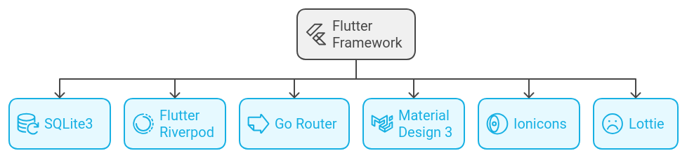

- **SQLite (via sqflite)** - [Package](https://pub.dev/packages/sqflite) | [Official Website](https://www.sqlite.org/index.html)

- **Riverpod** - [Documentation](https://riverpod.dev/) | [Package](https://pub.dev/packages/flutter_riverpod)

- **Material Design 3** - [Guidelines](https://m3.material.io/)

- **Ionicons** - [Website](https://ionic.io/ionicons) | [GitHub](https://github.com/ionic-team/ionicons)

- **go_router** - [Documentation](https://pub.dev/packages/go_router) | [GitHub](https://github.com/flutter/packages/tree/main/packages/go_router)

- **Lottie** - [Website](https://lottiefiles.com/) | [GitHub](https://github.com/airbnb/lottie-flutter)

### Role-Based Access

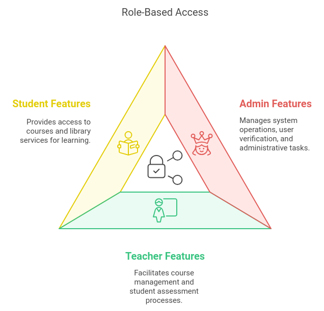

| Role    | Features                              |
| ------- | ------------------------------------- |
| Admin   | System Management, User Verification  |
| Teacher | Course Management, Student Assessment |
| Student | Course Access, Library Services       |

### Platform Support

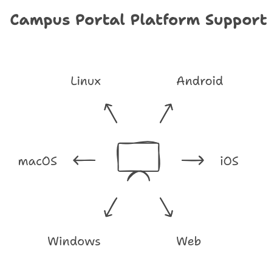

The campus portal system is designed to support all the platforms 

- Android

- ios

- Windows

- Mac

- linux

- web

---

## Project Objectives

### Primary Objectives

1. **Cross-Platform Accessibility**
   
   - Develop a fully functional campus management system accessible on mobile, web, and desktop platforms
   - Ensure consistent user experience across all supported platforms
   - Implement responsive design principles for various screen sizes

2. **Database Implementation**
   
   - Design and implement a robust SQLite database structure for academic data management
   - Ensure data integrity through ACID compliance
   - Implement efficient data relationships between users, courses, and library resources
   - Create a scalable database schema that supports future expansions

3. **Role-Based System Architecture**
   
   - Implement secure authentication and authorization systems
   - Develop role-specific interfaces and functionalities for:
     * Administrators (system management and user verification)
     * Teachers (course and student management)
     * Students (course access and library services)

4. **Academic Management**
   
   - Implement comprehensive course management system
   - Develop major and department organization structure
   - Create efficient student enrollment system
   - Enable course assignment to teachers

### Secondary Objectives

1. **Library System Integration**
   
   - Develop digital library management system
   - Implement book borrowing and return tracking
   - Create catalog management system
   - Enable book search and availability tracking

2. **User Experience**
   
   - Implement intuitive navigation using go_router
   - Develop responsive and modern UI using Material Design 3
   - Create smooth animations and transitions using Lottie
   - Ensure consistent state management using Riverpod

3. **Technical Excellence**
   
   - Implement clean architecture principles
   - Write maintainable and well-documented code
   - Create comprehensive database helper classes
   - Implement efficient error handling and logging
   - Ensure proper data seeding and migration support

### Performance Goals

1. **Database Performance**
   
   - Optimize query execution for large datasets
   - Implement efficient batch operations
   - Ensure smooth concurrent database operations
   - Maintain fast data retrieval and updates

2. **Application Responsiveness**
   
   - Achieve sub-second response times for common operations
   - Implement efficient state management
   - Optimize resource usage across platforms
   - Ensure smooth navigation between screens

3. **Data Integrity**
   
   - Implement proper foreign key constraints
   - Ensure transaction safety
   - Maintain data consistency across related tables
   - Implement proper data validation

## System Design Documentation

### Architecture Overview

#### High-Level Architecture Diagram

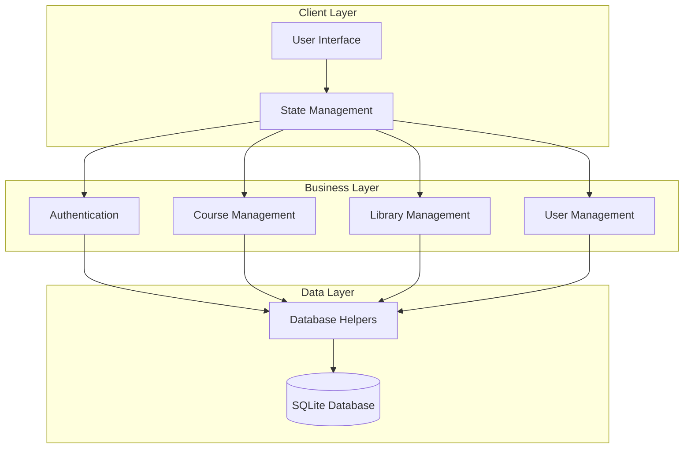
```mermaid
flowchart TB
    subgraph Client Layer
        UI[User Interface]
        State[State Management]
    end

    subgraph Business Layer
        Auth[Authentication]
        CourseM[Course Management]
        LibraryM[Library Management]
        UserM[User Management]
    end

    subgraph Data Layer
        DB[(SQLite Database)]
        Helper[Database Helpers]
    end

    UI --> State
    State --> Auth
    State --> CourseM
    State --> LibraryM
    State --> UserM
    Auth --> Helper
    CourseM --> Helper
    LibraryM --> Helper
    UserM --> Helper
    Helper --> DB
```

The system follows a three-layer architecture:

- **Client Layer**: Handles UI and state management using Flutter and Riverpod
- **Business Layer**: Contains core business logic and feature implementations
- **Data Layer**: Manages data persistence and database operations

#### Component Diagram

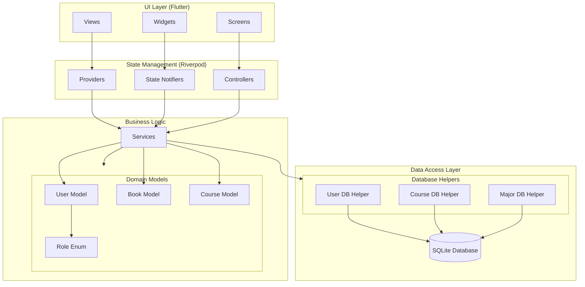
```mermaid
flowchart TB
    subgraph UI["UI Layer (Flutter)"]
        Views[Views]
        Widgets[Widgets]
        Screens[Screens]
    end

    subgraph State["State Management (Riverpod)"]
        Providers[Providers]
        StateNotifiers[State Notifiers]
        StateControllers[Controllers]
    end

    subgraph Business["Business Logic"]
        direction TB
        Services[Services]
        subgraph Models["Domain Models"]
            User[User Model]
            Book[Book Model]
            Course[Course Model]
            Role[Role Enum]
        end
    end

    subgraph Data["Data Access Layer"]
        direction TB
        subgraph DBHelpers["Database Helpers"]
            UserDB[User DB Helper]
            CourseDB[Course DB Helper]
            MajorDB[Major DB Helper]
        end
        SQLite[(SQLite Database)]
    end

    Views --> Providers
    Widgets --> StateNotifiers
    Screens --> StateControllers

    Providers --> Services
    StateNotifiers --> Services
    StateControllers --> Services

    Services --> Models
    Services --> DBHelpers

    UserDB --> SQLite
    CourseDB --> SQLite
    MajorDB --> SQLite

    %% Model relationships
    User --> Role
    Services --> User
    Services --> Book
    Services --> Course
```

### Data Flow Diagrams

#### Level 0 (Context Diagram)

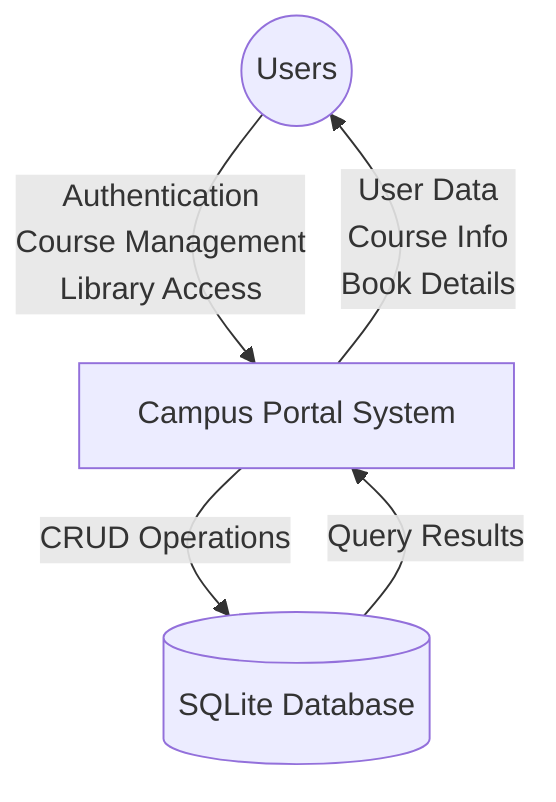
```mermaid
graph TD
    Users((Users))
    System[Campus Portal System]
    SQLite[(SQLite Database)]

    Users -->|Authentication<br/>Course Management<br/>Library Access| System
    System -->|User Data<br/>Course Info<br/>Book Details| Users
    System -->|CRUD Operations| SQLite
    SQLite -->|Query Results| System
```

#### Level 1 (Main Processes)

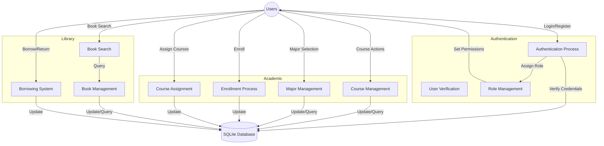
```mermaid
graph TD
    Users((Users))

    subgraph Authentication
        Auth[Authentication Process]
        Verify[User Verification]
        Role[Role Management]
    end

    subgraph Academic
        Course[Course Management]
        Major[Major Management]
        Enroll[Enrollment Process]
        Assignment[Course Assignment]
    end

    subgraph Library
        Books[Book Management]
        Borrow[Borrowing System]
        Search[Book Search]
    end

    DB[(SQLite Database)]

    Users -->|Login/Register| Auth
    Auth -->|Verify Credentials| DB
    Auth -->|Assign Role| Role
    Role -->|Set Permissions| Users

    Users -->|Course Actions| Course
    Course -->|Update/Query| DB
    Users -->|Major Selection| Major
    Major -->|Update/Query| DB
    Users -->|Enroll| Enroll
    Enroll -->|Update| DB
    Users -->|Assign Courses| Assignment
    Assignment -->|Update| DB

    Users -->|Book Search| Search
    Search -->|Query| Books
    Users -->|Borrow/Return| Borrow
    Books -->|Update/Query| DB
    Borrow -->|Update| DB
```

#### Level 2 (Detailed Library Process)

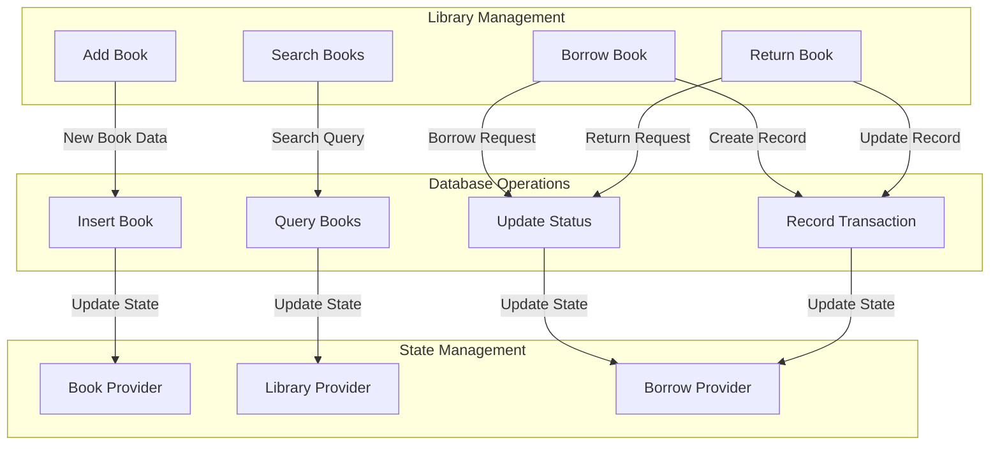
```mermaid
graph TD
    subgraph Library Management
        AddBook[Add Book]
        SearchBook[Search Books]
        BorrowBook[Borrow Book]
        ReturnBook[Return Book]
    end

    subgraph Database Operations
        Insert[Insert Book]
        Query[Query Books]
        Update[Update Status]
        Transaction[Record Transaction]
    end

    subgraph State Management
        BookState[Book Provider]
        LibraryState[Library Provider]
        BorrowState[Borrow Provider]
    end

    AddBook -->|New Book Data| Insert
    SearchBook -->|Search Query| Query
    BorrowBook -->|Borrow Request| Update
    BorrowBook -->|Create Record| Transaction
    ReturnBook -->|Return Request| Update
    ReturnBook -->|Update Record| Transaction

    Insert -->|Update State| BookState
    Query -->|Update State| LibraryState
    Update -->|Update State| BorrowState
    Transaction -->|Update State| BorrowState
```

#### Level 2 (Detailed Course Management)

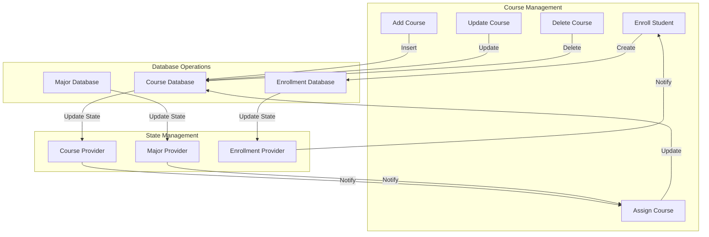
```mermaid
graph TD
    subgraph Course Management
        AddCourse[Add Course]
        UpdateCourse[Update Course]
        DeleteCourse[Delete Course]
        AssignCourse[Assign Course]
        EnrollStudent[Enroll Student]
    end

    subgraph Database Operations
        CourseDB[Course Database]
        MajorDB[Major Database]
        EnrollmentDB[Enrollment Database]
    end

    subgraph State Management
        CourseState[Course Provider]
        MajorState[Major Provider]
        EnrollmentState[Enrollment Provider]
    end

    AddCourse -->|Insert| CourseDB
    UpdateCourse -->|Update| CourseDB
    DeleteCourse -->|Delete| CourseDB
    AssignCourse -->|Update| CourseDB
    EnrollStudent -->|Create| EnrollmentDB

    CourseDB -->|Update State| CourseState
    MajorDB -->|Update State| MajorState
    EnrollmentDB -->|Update State| EnrollmentState

    CourseState -->|Notify| AssignCourse
    MajorState -->|Notify| AssignCourse
    EnrollmentState -->|Notify| EnrollStudent
```

#### Level 2 (User & Teacher Registration Process)

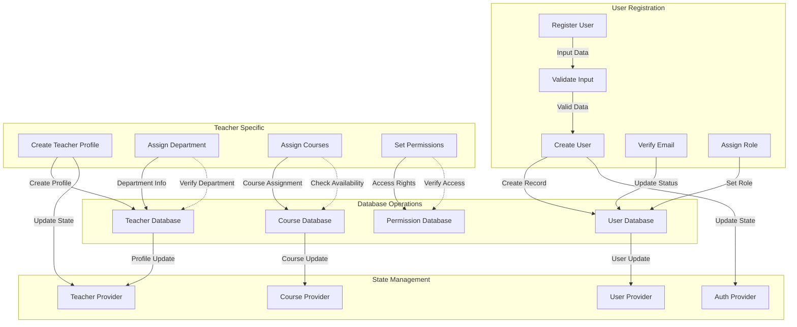
```mermaid
graph TD
    subgraph User Registration
        Register[Register User]
        Validate[Validate Input]
        CreateUser[Create User]
        VerifyEmail[Verify Email]
        AssignRole[Assign Role]
    end

    subgraph Teacher Specific
        TeacherProfile[Create Teacher Profile]
        AssignDept[Assign Department]
        AssignCourses[Assign Courses]
        SetPermissions[Set Permissions]
    end

    subgraph Database Operations
        UserDB[User Database]
        TeacherDB[Teacher Database]
        CourseDB[Course Database]
        PermissionDB[Permission Database]
    end

    subgraph State Management
        AuthState[Auth Provider]
        TeacherState[Teacher Provider]
        CourseState[Course Provider]
        UserState[User Provider]
    end

    %% User Registration Flow
    Register -->|Input Data| Validate
    Validate -->|Valid Data| CreateUser
    CreateUser -->|Create Record| UserDB
    CreateUser -->|Update State| AuthState
    VerifyEmail -->|Update Status| UserDB
    AssignRole -->|Set Role| UserDB

    %% Teacher Specific Flow
    TeacherProfile -->|Create Profile| TeacherDB
    TeacherProfile -->|Update State| TeacherState
    AssignDept -->|Department Info| TeacherDB
    AssignCourses -->|Course Assignment| CourseDB
    SetPermissions -->|Access Rights| PermissionDB

    %% State Updates
    TeacherDB -->|Profile Update| TeacherState
    CourseDB -->|Course Update| CourseState
    UserDB -->|User Update| UserState

    %% Validations and Checks
    AssignDept -.->|Verify Department| TeacherDB
    AssignCourses -.->|Check Availability| CourseDB
    SetPermissions -.->|Verify Access| PermissionDB
```

#### Level 2 (UI Navigation and Page Flow)

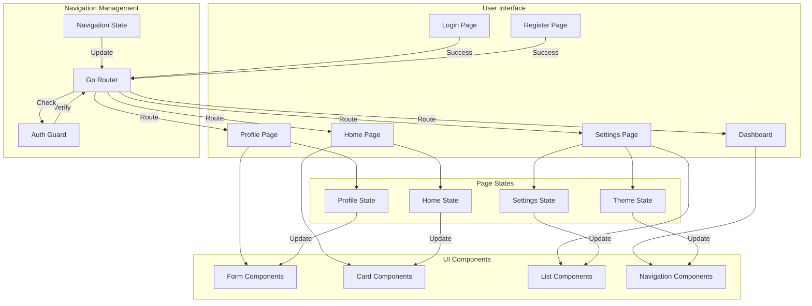
```mermaid
graph TD
    subgraph User Interface
        Login[Login Page]
        Register[Register Page]
        Home[Home Page]
        Dashboard[Dashboard]
        Profile[Profile Page]
        Settings[Settings Page]
    end

    subgraph Navigation Management
        Router[Go Router]
        NavState[Navigation State]
        AuthGuard[Auth Guard]
    end

    subgraph Page States
        HomeState[Home State]
        ProfileState[Profile State]
        SettingsState[Settings State]
        ThemeState[Theme State]
    end

    subgraph UI Components
        Forms[Form Components]
        Cards[Card Components]
        Lists[List Components]
        Navigation[Navigation Components]
    end

    %% Navigation Flow
    Login -->|Success| Router
    Register -->|Success| Router
    Router -->|Route| Home
    Router -->|Route| Dashboard
    Router -->|Route| Profile
    Router -->|Route| Settings

    %% State Management
    Home --> HomeState
    Profile --> ProfileState
    Settings --> SettingsState
    Settings --> ThemeState

    %% Component Usage
    Home --> Cards
    Profile --> Forms
    Settings --> Lists
    Dashboard --> Navigation

    %% Auth Flow
    AuthGuard -->|Verify| Router
    NavState -->|Update| Router
    Router -->|Check| AuthGuard

    %% Component Updates
    HomeState -->|Update| Cards
    ProfileState -->|Update| Forms
    SettingsState -->|Update| Lists
    ThemeState -->|Update| Navigation
```

This Level 2 DFD illustrates:

1. **Page Navigation Flow**
   
   - Login/Register authentication flow
   - Protected route navigation
   - Page-to-page transitions

2. **State Management**
   
   - Page-specific states
   - Theme state management
   - Navigation state tracking

3. **UI Components**
   
   - Reusable component hierarchy
   - Component state updates
   - Form handling

4. **Authentication**
   
   - Route protection
   - Auth state management
   - Login/Register flows

The diagram shows how the UI layer interacts with:

- Navigation management using go_router
- State management using Riverpod
- Component updates and reuse
- Authentication and authorization flows

### Database Design

#### Entity Relationship Diagram

#### Database Schema

Key Tables and Relationships:

1. **Users Table**
   
   - Primary key: id
   - Foreign keys: student_id, instructor_id
   - Manages user authentication and roles

2. **Courses Table**
   
   - Primary key: course_id
   - Foreign keys: major_id, instructor_id
   - Handles course information and assignments

3. **Library Tables**
   
   - Books and Transactions tables
   - Manages library resources and borrowing

### Sequence Diagrams

#### User Authentication Flow

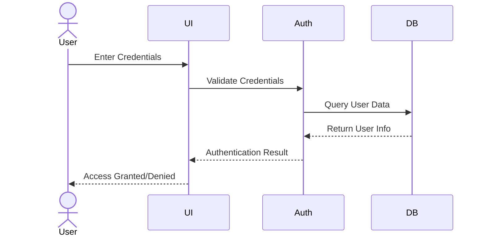
```mermaid
sequenceDiagram
    actor User
    participant UI
    participant Auth
    participant DB

    User->>UI: Enter Credentials
    UI->>Auth: Validate Credentials
    Auth->>DB: Query User Data
    DB-->>Auth: Return User Info
    Auth-->>UI: Authentication Result
    UI-->>User: Access Granted/Denied
```

#### Course Registration Flow

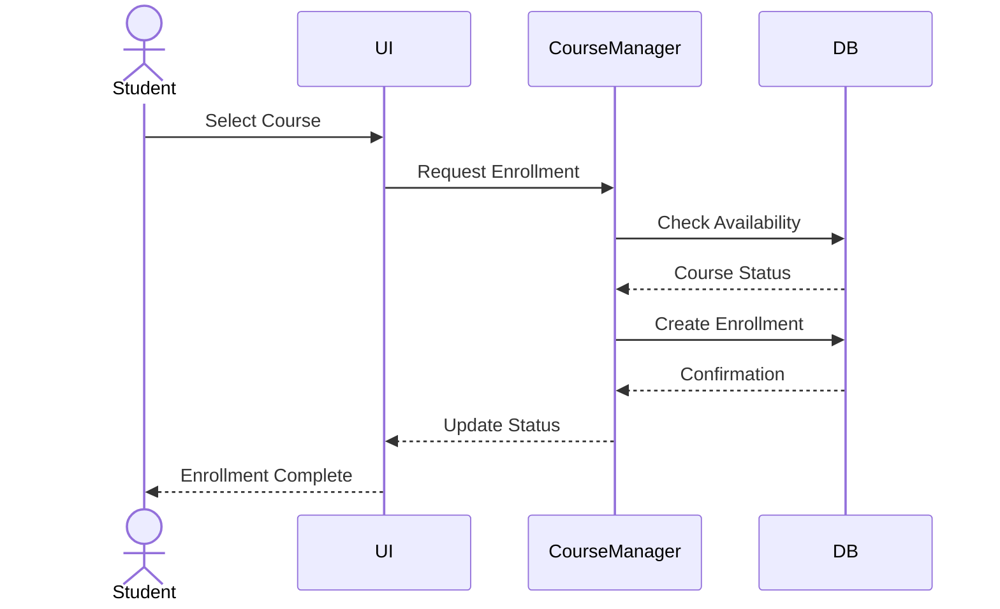
```mermaid
sequenceDiagram
    actor Student
    participant UI
    participant CourseManager
    participant DB

    Student->>UI: Select Course
    UI->>CourseManager: Request Enrollment
    CourseManager->>DB: Check Availability
    DB-->>CourseManager: Course Status
    CourseManager->>DB: Create Enrollment
    DB-->>CourseManager: Confirmation
    CourseManager-->>UI: Update Status
    UI-->>Student: Enrollment Complete
```

#### Library Management Flow

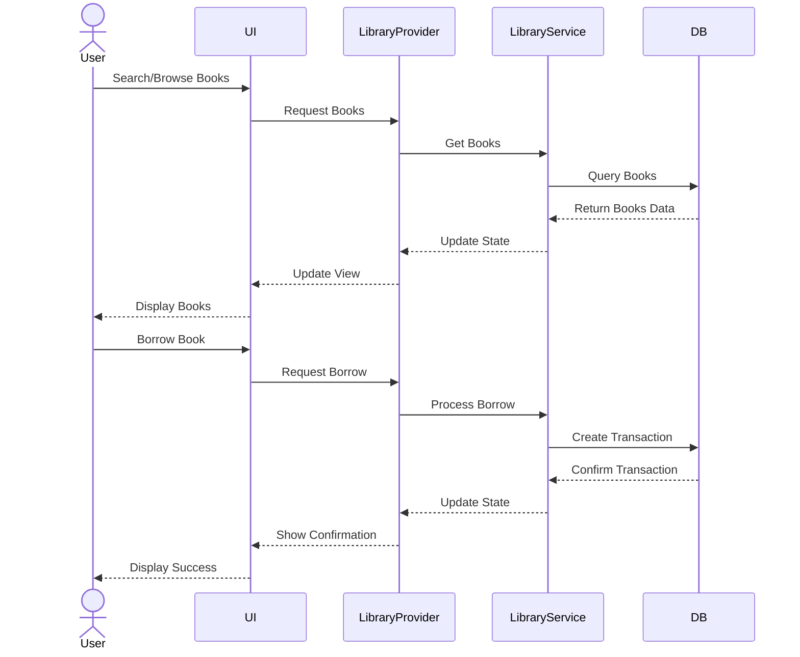
```mermaid
sequenceDiagram
    actor User
    participant UI
    participant LibraryProvider
    participant LibraryService
    participant DB

    User->>UI: Search/Browse Books
    UI->>LibraryProvider: Request Books
    LibraryProvider->>LibraryService: Get Books
    LibraryService->>DB: Query Books
    DB-->>LibraryService: Return Books Data
    LibraryService-->>LibraryProvider: Update State
    LibraryProvider-->>UI: Update View
    UI-->>User: Display Books

    User->>UI: Borrow Book
    UI->>LibraryProvider: Request Borrow
    LibraryProvider->>LibraryService: Process Borrow
    LibraryService->>DB: Create Transaction
    DB-->>LibraryService: Confirm Transaction
    LibraryService-->>LibraryProvider: Update State
    LibraryProvider-->>UI: Show Confirmation
    UI-->>User: Display Success
```

#### User Verification Flow

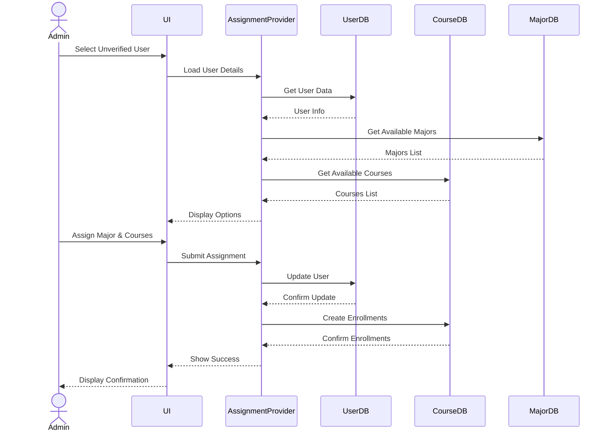
```mermaid
sequenceDiagram
    actor Admin
    participant UI
    participant AssignmentProvider
    participant UserDB
    participant CourseDB
    participant MajorDB

    Admin->>UI: Select Unverified User
    UI->>AssignmentProvider: Load User Details
    AssignmentProvider->>UserDB: Get User Data
    UserDB-->>AssignmentProvider: User Info
    AssignmentProvider->>MajorDB: Get Available Majors
    MajorDB-->>AssignmentProvider: Majors List
    AssignmentProvider->>CourseDB: Get Available Courses
    CourseDB-->>AssignmentProvider: Courses List
    AssignmentProvider-->>UI: Display Options

    Admin->>UI: Assign Major & Courses
    UI->>AssignmentProvider: Submit Assignment
    AssignmentProvider->>UserDB: Update User
    UserDB-->>AssignmentProvider: Confirm Update
    AssignmentProvider->>CourseDB: Create Enrollments
    CourseDB-->>AssignmentProvider: Confirm Enrollments
    AssignmentProvider-->>UI: Show Success
    UI-->>Admin: Display Confirmation
```

#### Course Management Flow

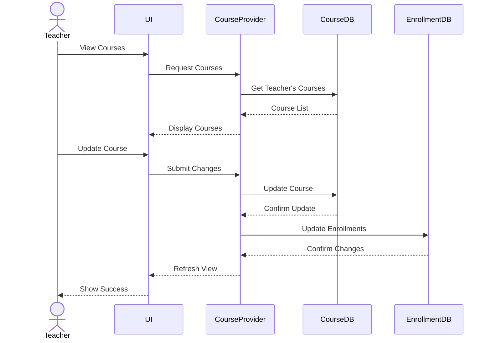
```mermaid
sequenceDiagram
    actor Teacher
    participant UI
    participant CourseProvider
    participant CourseDB
    participant EnrollmentDB

    Teacher->>UI: View Courses
    UI->>CourseProvider: Request Courses
    CourseProvider->>CourseDB: Get Teacher's Courses
    CourseDB-->>CourseProvider: Course List
    CourseProvider-->>UI: Display Courses

    Teacher->>UI: Update Course
    UI->>CourseProvider: Submit Changes
    CourseProvider->>CourseDB: Update Course
    CourseDB-->>CourseProvider: Confirm Update
    CourseProvider->>EnrollmentDB: Update Enrollments
    EnrollmentDB-->>CourseProvider: Confirm Changes
    CourseProvider-->>UI: Refresh View
    UI-->>Teacher: Show Success
```

#### Student Enrollment Flow

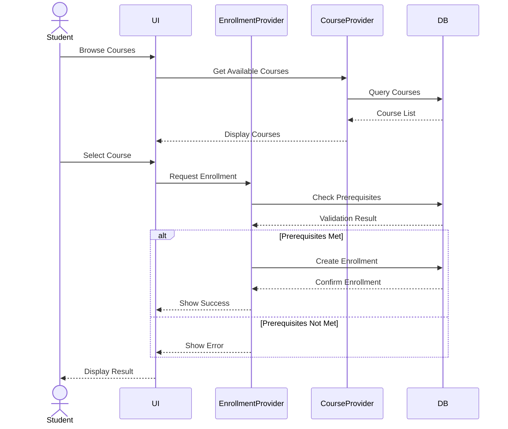
```mermaid
sequenceDiagram
    actor Student
    participant UI
    participant EnrollmentProvider
    participant CourseProvider
    participant DB

    Student->>UI: Browse Courses
    UI->>CourseProvider: Get Available Courses
    CourseProvider->>DB: Query Courses
    DB-->>CourseProvider: Course List
    CourseProvider-->>UI: Display Courses

    Student->>UI: Select Course
    UI->>EnrollmentProvider: Request Enrollment
    EnrollmentProvider->>DB: Check Prerequisites
    DB-->>EnrollmentProvider: Validation Result

    alt Prerequisites Met
        EnrollmentProvider->>DB: Create Enrollment
        DB-->>EnrollmentProvider: Confirm Enrollment
        EnrollmentProvider-->>UI: Show Success
    else Prerequisites Not Met
        EnrollmentProvider-->>UI: Show Error
    end

    UI-->>Student: Display Result
```

#### Theme Management Flow

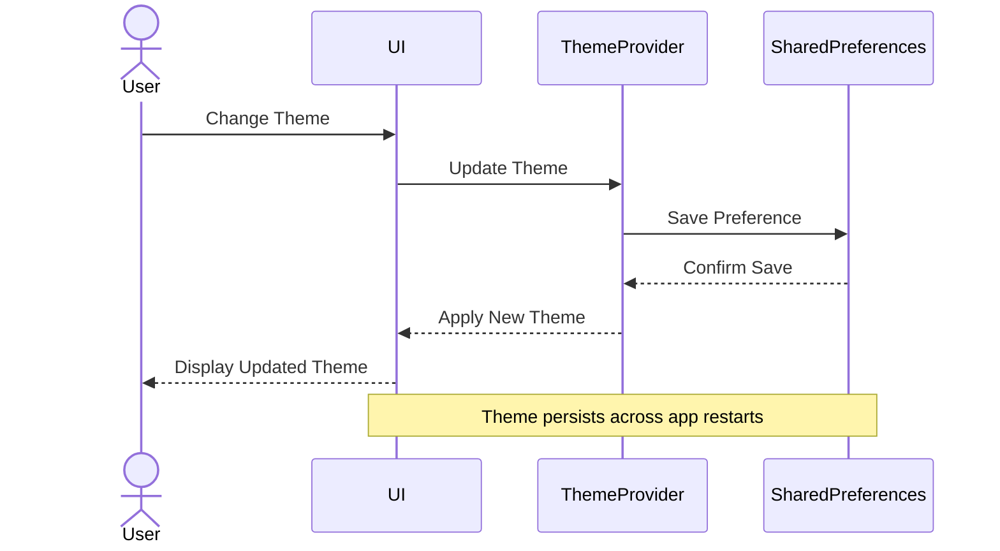
```mermaid
sequenceDiagram
    actor User
    participant UI
    participant ThemeProvider
    participant SharedPreferences

    User->>UI: Change Theme
    UI->>ThemeProvider: Update Theme
    ThemeProvider->>SharedPreferences: Save Preference
    SharedPreferences-->>ThemeProvider: Confirm Save
    ThemeProvider-->>UI: Apply New Theme
    UI-->>User: Display Updated Theme

    Note over UI,SharedPreferences: Theme persists across app restarts
```

### State Diagrams

#### User Session States

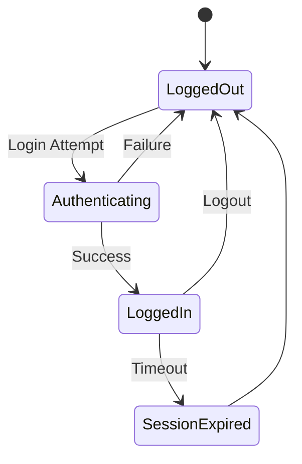
```mermaid
stateDiagram-v2
    [*] --> LoggedOut
    LoggedOut --> Authenticating: Login Attempt
    Authenticating --> LoggedIn: Success
    Authenticating --> LoggedOut: Failure
    LoggedIn --> LoggedOut: Logout
    LoggedIn --> SessionExpired: Timeout
    SessionExpired --> LoggedOut
```

#### Book Borrowing States

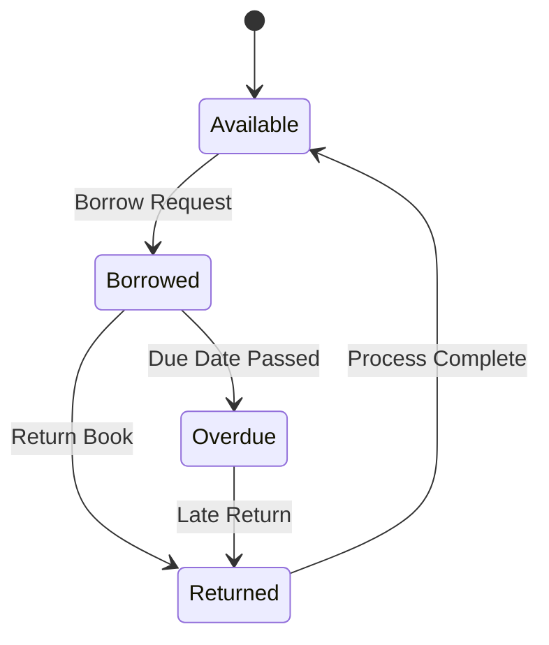
```mermaid
stateDiagram-v2
    [*] --> Available
    Available --> Borrowed: Borrow Request
    Borrowed --> Returned: Return Book
    Returned --> Available: Process Complete
    Borrowed --> Overdue: Due Date Passed
    Overdue --> Returned: Late Return
```

### Use Case Diagrams

#### Admin Use Cases

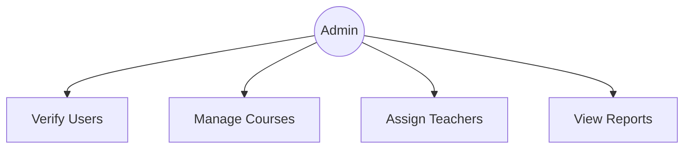
```mermaid
graph TD
    Admin((Admin))
    V[Verify Users]
    M[Manage Courses]
    A[Assign Teachers]
    R[View Reports]

    Admin --> V
    Admin --> M
    Admin --> A
    Admin --> R
```

#### Teacher Use Cases

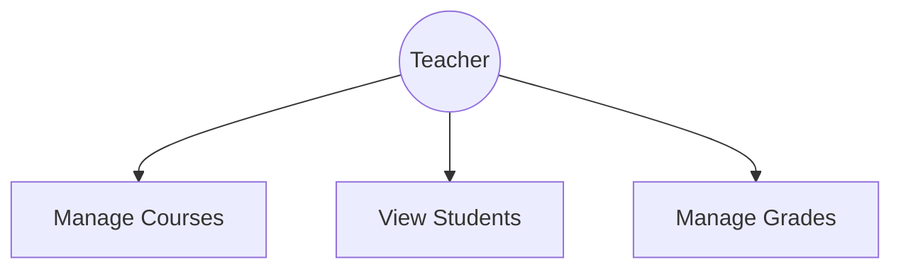
```mermaid
graph TD
    Teacher((Teacher))
    C[Manage Courses]
    S[View Students]
    G[Manage Grades]

    Teacher --> C
    Teacher --> S
    Teacher --> G
```

#### Student Use Cases

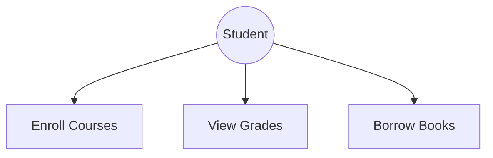
```mermaid
graph TD
    Student((Student))
    E[Enroll Courses]
    V[View Grades]
    B[Borrow Books]

    Student --> E
    Student --> V
    Student --> B
```

This comprehensive system design documentation:

1. Illustrates the system architecture at multiple levels
2. Shows data flow and process interactions
3. Details database relationships and schema
4. Demonstrates user interactions and state transitions
5. Provides clear visualization of system components and their relationships

Would you like me to:

1. Add more specific diagrams for any section?
2. Provide more detailed explanations?
3. Focus on any particular aspect of the system?

## Implementation

### SQLite3 Implementation with sqflite

#### Database Configuration

```dart:lib/database/common_database_helper.dart
class CommonDatabaseHelper {
  static final CommonDatabaseHelper _instance = CommonDatabaseHelper._internal();
  static Database? _database;

  factory CommonDatabaseHelper() => _instance;

  CommonDatabaseHelper._internal();

  Future<Database> get database async {
    if (_database != null) return _database!;
    _database = await _initDatabase();
    return _database!;
  }

  Future<Database> _initDatabase() async {
    String path = join(await getDatabasesPath(), 'campus_portal.db');
    return await openDatabase(
      path,
      version: 1,
      onCreate: _onCreate,
      onUpgrade: _onUpgrade,
    );
  }
}
```

#### Table Creation and Schema Management

```sql
-- Users Table
CREATE TABLE users (
    id INTEGER PRIMARY KEY AUTOINCREMENT,
    username TEXT NOT NULL UNIQUE,
    email TEXT NOT NULL UNIQUE,
    role TEXT NOT NULL,
    created_at TIMESTAMP DEFAULT CURRENT_TIMESTAMP
);

-- Courses Table
CREATE TABLE courses (
    course_id INTEGER PRIMARY KEY AUTOINCREMENT,
    code TEXT NOT NULL UNIQUE,
    title TEXT NOT NULL,
    credits INTEGER NOT NULL,
    instructor_id INTEGER,
    FOREIGN KEY (instructor_id) REFERENCES users(id)
);

-- Library Books Table
CREATE TABLE books (
    book_id INTEGER PRIMARY KEY AUTOINCREMENT,
    isbn TEXT UNIQUE,
    title TEXT NOT NULL,
    author TEXT NOT NULL,
    available BOOLEAN DEFAULT true
);
```

#### Database Helper Implementation

The project implements specialized database helpers for different entities:

1. **User Database Operations**
   
   ```dart:lib/database/user_database_helper.dart
   class UserDatabaseHelper extends CommonDatabaseHelper {
   Future<int> insertUser(User user) async {
    final db = await database;
    return await db.insert(
      'users',
      user.toMap(),
      conflictAlgorithm: ConflictAlgorithm.replace,
    );
   }
   
   Future<List<User>> getUsers() async {
    final db = await database;
    final List<Map<String, dynamic>> maps = await db.query('users');
    return List.generate(maps.length, (i) => User.fromMap(maps[i]));
   }
   }
   ```

2. **Course Database Operations**
   
   ```dart:lib/database/course_database_helper.dart
   class CourseDatabaseHelper extends CommonDatabaseHelper {
   Future<List<Course>> getCoursesByInstructor(int instructorId) async {
    final db = await database;
    final List<Map<String, dynamic>> maps = await db.query(
      'courses',
      where: 'instructor_id = ?',
      whereArgs: [instructorId],
    );
    return List.generate(maps.length, (i) => Course.fromMap(maps[i]));
   }
   }
   ```

#### Transaction Management

```dart:lib/database/transaction_helper.dart
Future<void> enrollStudentInCourse(int studentId, int courseId) async {
  final db = await database;
  await db.transaction((txn) async {
    // Check course availability
    final courseResult = await txn.query(
      'courses',
      where: 'course_id = ? AND available = ?',
      whereArgs: [courseId, 1],
    );

    if (courseResult.isEmpty) {
      throw Exception('Course not available');
    }

    // Create enrollment
    await txn.insert('enrollments', {
      'student_id': studentId,
      'course_id': courseId,
      'enrolled_at': DateTime.now().toIso8601String(),
    });

    // Update course availability if needed
    await txn.update(
      'courses',
      {'available': 0},
      where: 'course_id = ?',
      whereArgs: [courseId],
    );
  });
}
```

#### Query Optimization

1. **Indexed Queries**
   
   ```dart:lib/database/query_helper.dart
   // Creating indexes for frequently accessed columns
   await db.execute('''
   CREATE INDEX idx_user_email ON users(email);
   CREATE INDEX idx_course_code ON courses(code);
   CREATE INDEX idx_book_isbn ON books(isbn);
   ''');
   ```

// Using indexed columns in queries
Future<User?> getUserByEmail(String email) async {
  final db = await database;
  final results = await db.query(
    'users',
    where: 'email = ?',
    whereArgs: [email],
    limit: 1,
  );
  return results.isNotEmpty ? User.fromMap(results.first) : null;
}

```
2. **Batch Operations**
```dart:lib/database/batch_helper.dart
Future<void> insertMultipleBooks(List<Book> books) async {
  final db = await database;
  final batch = db.batch();

  for (var book in books) {
    batch.insert('books', book.toMap());
  }

  await batch.commit(noResult: true);
}
```

#### Error Handling and Logging

```dart:lib/database/error_handler.dart
Future<T> executeDbOperation<T>(Future<T> Function() operation) async {
  try {
    return await operation();
  } on DatabaseException catch (e) {
    log('Database error: ${e.toString()}');
    throw DatabaseError('Operation failed: ${e.message}');
  } catch (e) {
    log('Unexpected error: ${e.toString()}');
    throw DatabaseError('Unexpected error occurred');
  }
}
```

#### Migration Management

```dart:lib/database/migration_helper.dart
Future<void> _onUpgrade(Database db, int oldVersion, int newVersion) async {
  if (oldVersion < 2) {
    // Add new columns to existing tables
    await db.execute('''
      ALTER TABLE users 
      ADD COLUMN last_login TIMESTAMP;
    ''');
  }

  if (oldVersion < 3) {
    // Create new tables
    await db.execute('''
      CREATE TABLE user_settings (
        user_id INTEGER PRIMARY KEY,
        theme TEXT,
        notifications BOOLEAN,
        FOREIGN KEY (user_id) REFERENCES users(id)
      );
    ''');
  }
}
```

### Key Features of SQLite Implementation

1. **ACID Compliance**
   
   - Transactions ensure data integrity
   - Concurrent access handling
   - Rollback support for failed operations

2. **Performance Optimization**
   
   - Indexed queries for faster lookups
   - Batch operations for bulk data handling
   - Efficient join operations

3. **Data Security**
   
   - Input validation
   - Prepared statements to prevent SQL injection
   - Error handling and logging

4. **Scalability**
   
   - Migration support for schema updates
   - Batch processing for large datasets
   - Efficient memory usage

[Detail the implementation process, focusing on key technologies and their integration.]

### Tools and Technologies

- **Flutter**: [Why you chose Flutter and its role in the project.]
- **SQLite3 (via sqflite)**: [How the database integration is handled.]
- **Riverpod**: [Explain why you used Riverpod for state management.]
- **go_router**: [How navigation is managed.]

### Code Snippets

[Insert brief, well-commented code snippets to illustrate key implementation steps.]

---

## Features and Functionality

[List the main features of your project.]

### Key Features

1. **[Feature 1: Description]**
   - [E.g., "Add, update, delete records in the database."]
2. **[Feature 2: Description]**
   - [E.g., "Real-time state updates using Riverpod."]

---

## Challenges and Solutions

[Discuss the challenges faced during development and how you addressed them.]

### Challenge 1: [Description]

- **Solution**: [Explain how you solved this issue.]

### Challenge 2: [Description]

- **Solution**: [Explain how you solved this issue.]

---

## Testing and Validation

[Explain how you tested the app and validated its functionality.]

### Testing Methodology

- **Unit Testing**: [Describe tests written for individual functions.]
- **Integration Testing**: [Describe how components were tested together.]

### Results

[Insert test results or screenshots.]

---

## Conclusion

[Summarize the outcomes of your project, lessons learned, and the overall success of the implementation.]

---

## Future Enhancements

[List potential improvements or additional features that could be added in the future.]

1. **Feature 1**: [E.g., "Implement cloud synchronization for the database."]
2. **Feature 2**: [E.g., "Add advanced data visualization features."]

---

## References

[Add references for any libraries, frameworks, or resources used.]

---

## Appendix

[Include any additional diagrams, tables, or code that supports the report.]
