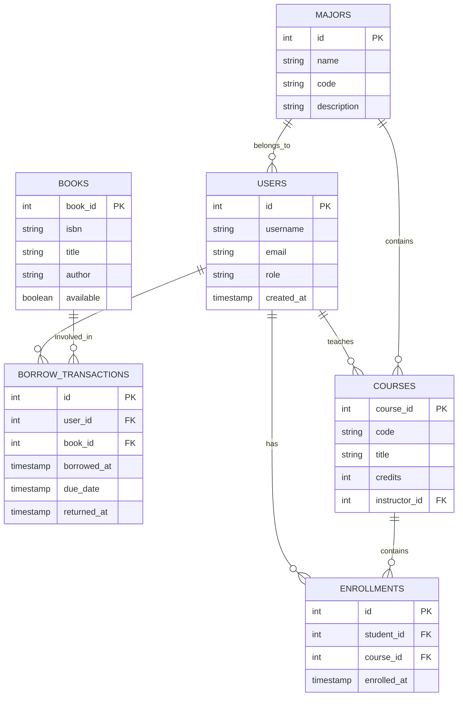
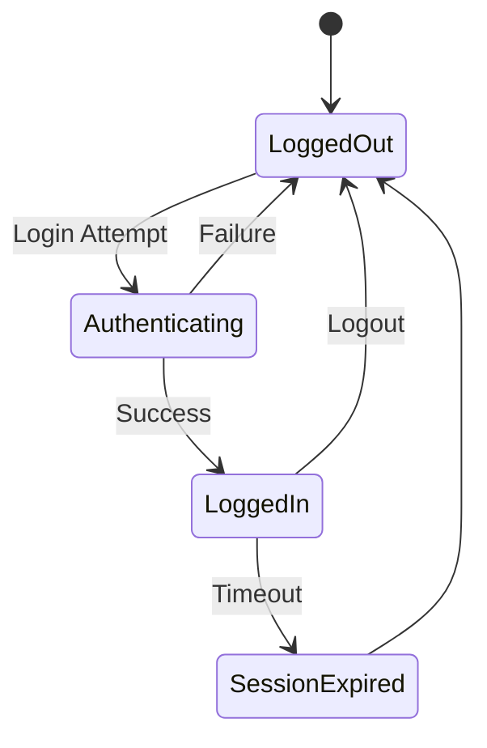
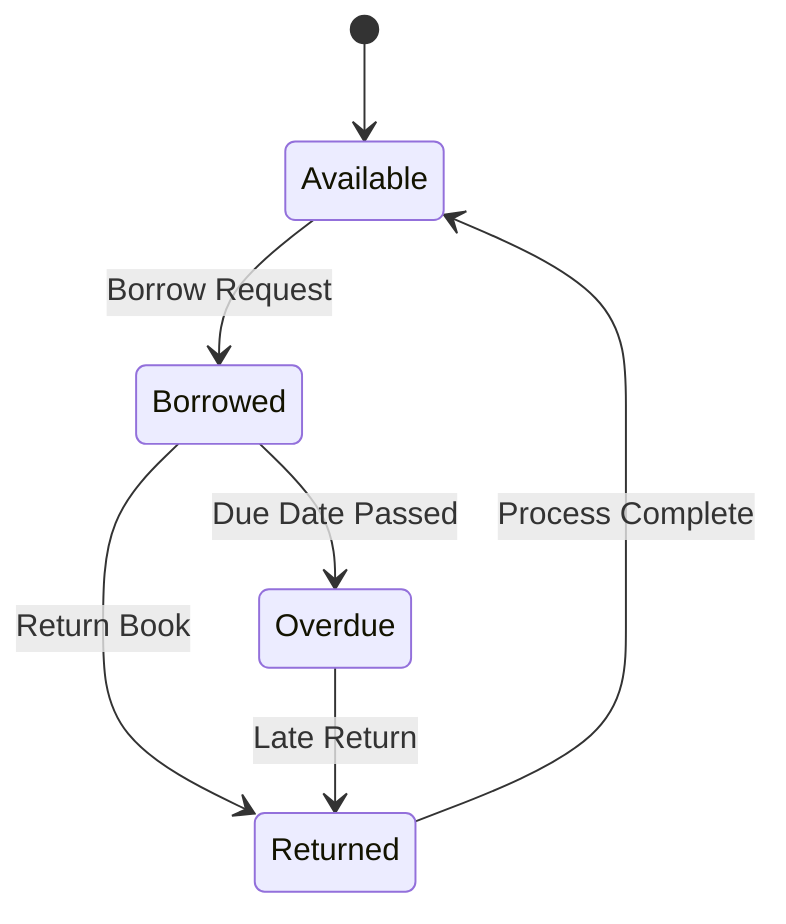
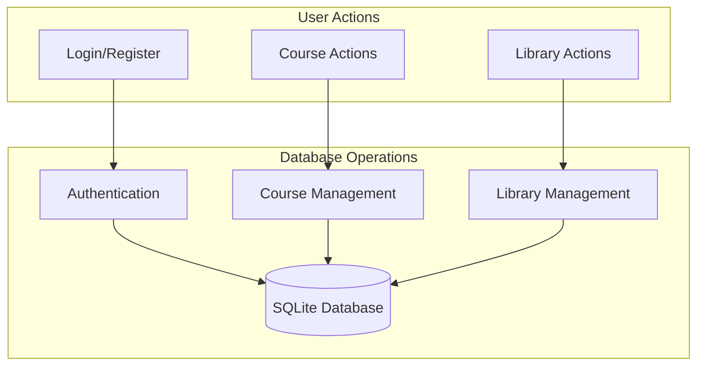
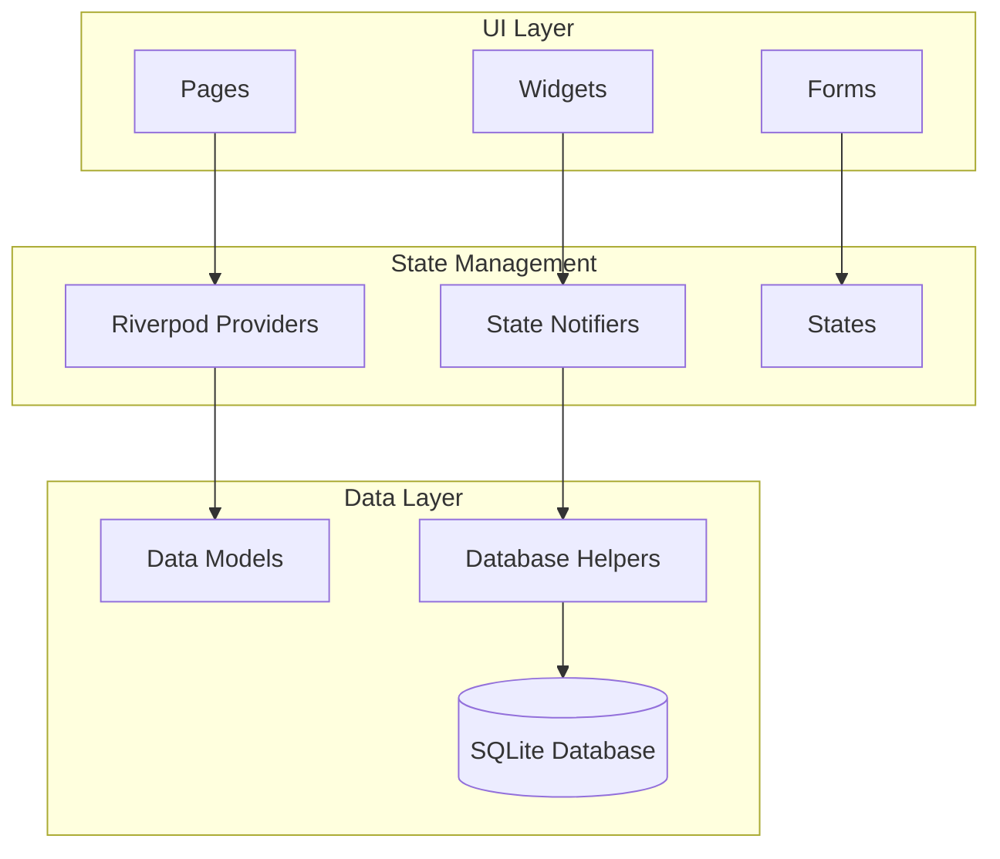
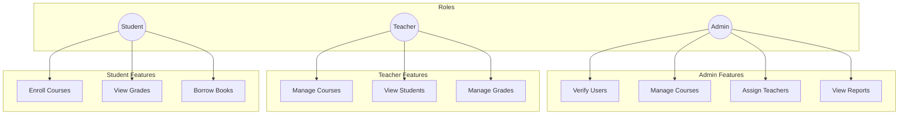
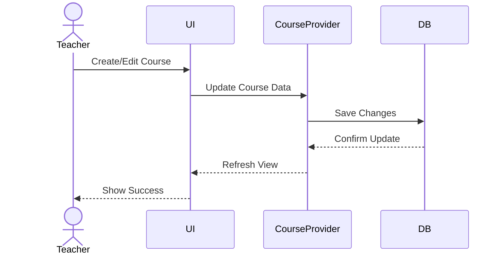
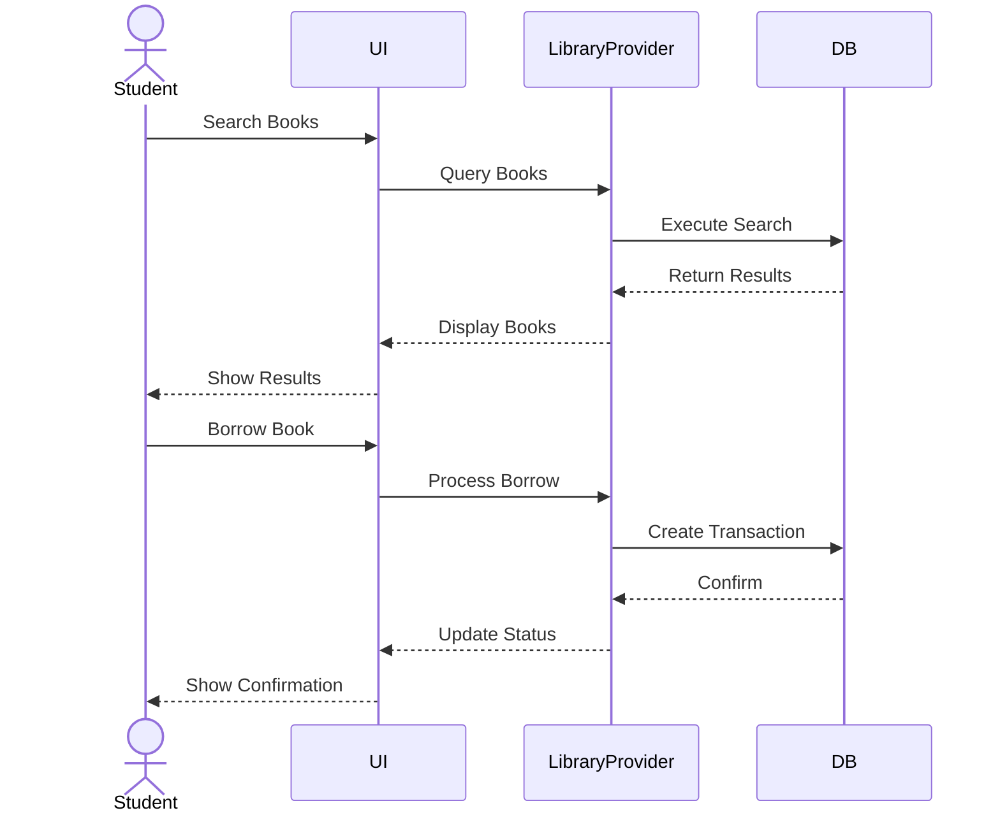

# 1. Introduction

## 1.1 Project Overview
For my Database Application Development course project, under Professor Wen Dawei's guidance, I developed a comprehensive Campus Portal System. This project allowed me to implement a cross-platform application that demonstrates both my understanding of advanced database concepts and practical application development skills. I chose to build this system because it presented an opportunity to work with complex database relationships while creating something useful for academic environments.

### 1.1.1 Project Screenshots Overview

*Figure 1.1: Login Screen showing role-based authentication*

*Figure 1.2: Main dashboard showing different user role views*

## 1.2 Course Context
Throughout Professor Wen Dawei's Database Application Development course, we learned about implementing database systems in real-world applications. This project became my practical demonstration of the course concepts, where I applied:
- Database design principles we learned in class
- Query optimization techniques
- Transaction management in real scenarios
- Handling concurrent data access
- Building cross-platform applications

## 1.3 Project Objectives
### 1.3.1 Primary Goals
When I started this project, I set several key objectives:
- Implementing SQLite database using Flutter's sqflite package, which I found to be the most suitable for cross-platform development
- Creating a complete CRUD application that would demonstrate database operations
- Developing a role-based system that could handle different user types (admin, teacher, student)
- Building efficient data relationships that would maintain data integrity
- Putting into practice the database concepts we learned in class

### 1.3.2 Learning Journey
Throughout this project, I:
- Mastered database design principles through practical implementation
- Gained hands-on experience with transaction management
- Learned how to develop for multiple platforms using Flutter
- Implemented state management using Riverpod
- Applied security practices in database operations

## 1.4 Technology Stack
### 1.4.1 Core Technologies
After careful consideration, I chose these technologies:
- **Database**: I selected SQLite3 via sqflite package because it provided excellent local database capabilities
- **Framework**: Flutter became my choice for its cross-platform abilities
- **State Management**: I implemented Riverpod for its intuitive state management
- **Navigation**: go_router helped me handle complex routing scenarios
- **UI**: Material Design 3 gave me a modern, consistent look

### 1.4.2 Development Tools
During development, I used:
- **IDE**: I worked primarily in Android Studio for its Flutter support
- **Testing**: Flutter's test framework for ensuring reliability
- **Documentation**: I used Markdown with Mermaid for clear documentation

## 1.5 Project Scope
In my implementation, I included:
- A complete authentication system with different user roles
- A course management system for teachers
- A library system for book management
- Student enrollment functionality
- Academic record keeping
- Support for multiple platforms (Android, iOS, Web, Desktop)

## 1.6 Report Structure
In this report, I'll walk through:
1. How I designed and implemented the database
2. The helper classes I created
3. My data access layer implementation
4. The testing approaches I used
5. Security measures I implemented
6. Performance optimizations I made
7. Details of the Flutter application
8. Specific features I developed
9. Quality assurance measures
10. Future improvements I've identified

Each section reflects my journey in building this system, including the challenges I faced and how I overcame them. This project has been a practical application of the database concepts we learned in Professor Wen Dawei's course, and I'm excited to share the details of my implementation.

# 2. Database Design & Implementation
## 2.1 Requirements Analysis
- Database Requirements
- Data Storage Needs
- Relationship Requirements
- Performance Requirements

## 2.2 Database Schema Design
### 2.2.1 Entity Relationship Diagrams

### 2.2.2 Table Structures
- Users Table Design
- Academic Tables Design
- Library Tables Design
- Relationship Tables Design

### 2.2.2 Table Structures Implementation

*Figure 2.1: Implemented database schema in SQLite Browser*

*Figure 2.2: Visual representation of table relationships*

## 2.3 Normalization Process
- First Normal Form Implementation
- Second Normal Form Implementation
- Third Normal Form Implementation
- Denormalization Decisions

## 2.4 Database Operations
### 2.4.1 CRUD Operations
- Create Operations Implementation
- Read Operations Implementation
- Update Operations Implementation
- Delete Operations Implementation

### 2.4.2 Transaction Management
- ACID Properties Implementation
- Concurrent Access Handling
- Transaction Isolation Levels
- Rollback Mechanisms

### 2.4.3 State Management Diagrams

#### Book Borrowing States

### 2.4.4 Data Flow Diagrams

## 2.5 Query Optimization
- Index Design & Implementation
- Query Performance Analysis
- Join Optimization
- Cache Implementation
- Materialized Views Usage
- Query Plan Analysis & Tuning

## 2.6 Advanced Database Features
### 2.6.1 Partitioning
- Table Partitioning Strategies
- Range Partitioning Implementation
- List Partitioning for Categorical Data
- Hash Partitioning for Load Distribution
- Partition Pruning Optimization

### 2.6.2 Replication & High Availability
- Master-Slave Replication Setup
- Multi-Master Replication
- Failover Configuration
- Data Consistency Management
- Replication Lag Monitoring

### 2.6.3 Sharding Implementation
- Horizontal Sharding Strategy
- Shard Key Selection
- Cross-Shard Query Handling
- Shard Balancing Mechanisms
- Distributed Transaction Management

### 2.6.4 Advanced Indexing
- Bitmap Indexes
- Partial Indexes
- Covering Indexes
- GiST and GIN Indexes
- Index-Only Scans

### 2.6.5 Concurrency Control
- Multi-Version Concurrency Control (MVCC)
- Optimistic vs Pessimistic Locking
- Deadlock Prevention Strategies
- Lock Escalation Mechanisms
- Row-Level vs Table-Level Locking

### 2.6.6 Database Recovery
- Point-in-Time Recovery
- Write-Ahead Logging (WAL)
- Checkpoint Management
- Archive Log Management
- Hot Backup Implementation

### 2.6.7 In-Memory Database Features
- Memory-Optimized Tables
- Compiled Stored Procedures
- In-Memory OLTP
- Buffer Pool Extensions
- Memory Management Strategies

### 2.6.8 Distributed Database Management
- Distributed Query Processing
- Two-Phase Commit Protocol
- Distributed Transaction Coordination
- Network Partition Handling
- CAP Theorem Considerations

# 3. Database Helper Classes
## 3.1 Core Database Helper
- Database Configuration
- Connection Management
- Migration Handling
- Error Handling

## 3.2 Specialized Helpers
- User Database Operations
- Course Database Operations
- Library Database Operations
- Major Database Operations

# 4. Data Access Layer
## 4.1 Database Models
- Model Class Implementations
- Data Mapping Strategies
- Validation Logic
- Type Conversion Handling

## 4.2 Query Building
- SQL Query Construction
- Parameter Binding
- Result Mapping
- Error Handling

# 5. Database Testing
## 5.1 Unit Testing
- Table Creation Tests
- CRUD Operation Tests
- Transaction Tests
- Constraint Tests

## 5.2 Integration Testing
- Cross-Table Operations
- Complex Query Testing
- Transaction Flow Testing
- Error Recovery Testing

## 5.3 Performance Testing
- Query Performance Metrics
- Load Testing Results
- Concurrent Access Testing
- Memory Usage Analysis

## 5.4 Concurrency Testing
- Deadlock Scenario Testing
- Race Condition Detection
- Lock Contention Analysis
- Transaction Isolation Testing
- Recovery Testing

## 5.5 Distributed Testing
- Network Partition Testing
- Replication Consistency Tests
- Cross-Datacenter Latency Tests
- Failover Scenario Testing
- Split-Brain Prevention Tests

# 6. Database Security
## 6.1 Data Protection
- Input Validation
- SQL Injection Prevention
- Data Encryption
- Access Control

## 6.2 Error Handling
- Exception Management
- Data Recovery
- Logging Implementation
- Debug Support

## 6.3 Advanced Security Measures
- Row-Level Security Implementation
- Column-Level Encryption
- Audit Logging
- Security Policies
- Dynamic Data Masking

# 7. Implementation Challenges & Solutions
## 7.1 Design Challenges
- Schema Design Issues
- Relationship Complexities
- Performance Bottlenecks
- Platform Limitations

## 7.2 Technical Solutions
- Query Optimization Techniques
- Index Implementation
- Cache Strategies
- Transaction Management Solutions

## 7.3 Concurrency Challenges
- Lock Contention Resolution
- Deadlock Management
- Transaction Timeout Handling
- Hot Spot Access Patterns
- Read/Write Skew Handling

## 7.4 Distributed System Challenges
- Network Latency Management
- Data Consistency Across Nodes
- Split-Brain Scenarios
- Clock Synchronization
- Cross-Datacenter Replication

# 8. Performance Analysis
## 8.1 Query Performance
- SELECT Query Performance
- INSERT Performance
- UPDATE Performance
- DELETE Performance

## 8.2 Index Performance
- Index Usage Statistics
- Index Size Impact
- Query Plan Analysis
- Optimization Results

## 8.3 Scalability Metrics
- Connection Pooling Performance
- Replication Lag Analysis
- Sharding Performance Impact
- Partition Query Performance

## 8.4 Advanced Monitoring
- Real-time Query Analysis
- Resource Usage Tracking
- Deadlock Detection
- Buffer Cache Hit Ratio
- Table and Index Bloat

## 8.5 Concurrency Metrics
- Lock Wait Times
- Deadlock Frequency
- Transaction Throughput
- Concurrent User Impact
- Lock Escalation Frequency

## 8.6 Distribution Metrics
- Cross-Node Query Latency
- Replication Stream Metrics
- Network Bandwidth Usage
- Data Consistency Delays
- Node Health Statistics

# 9. Flutter Application Implementation
## 9.1 Application Architecture
### 9.1.1 State Management
- Riverpod Implementation
- State Providers Design
- State Persistence Strategy
- Database State Synchronization

### 9.1.2 Routing System
- Go Router Configuration
- Route Guards Implementation
- Deep Linking Support
- Navigation State Management

### 9.1.3 Widget Architecture
- Reusable Components
- Responsive Design Implementation
- Platform-Specific Adaptations
- Widget State Management

### 9.1.4 Application Architecture Diagram

## 9.2 Database Integration
### 9.2.1 Database Providers
- User Data Providers
- Course Data Providers
- Library Data Providers
- Settings Data Providers

### 9.2.2 Data Models
- Model Class Implementations
- JSON Serialization
- Database Mapping
- Data Validation

### 9.2.3 Database Operations
- CRUD Operation Wrappers
- Transaction Handlers
- Batch Operation Management
- Error Handling

## 9.3 User Interface
### 9.3.1 Material Design Implementation
- Theme Configuration
- Custom Components
- Responsive Layouts
- Platform Adaptations

### 9.3.2 Role-Based Interfaces
- Admin Dashboard
- Teacher Interface
- Student Portal
- Library Management Interface

### 9.3.3 Forms and Validation
- Input Validation
- Form State Management
- Error Handling
- User Feedback

### 9.3.1 Material Design Implementation

*Figure 9.1: Material Design 3 theming with light and dark mode*

### 9.3.2 Role-Based Interfaces

*Figure 9.2: Admin dashboard showing user management*

*Figure 9.3: Teacher's course management interface*

*Figure 9.4: Student's course enrollment and library access*

### 9.3.3 Forms and Validation

*Figure 9.5: Dynamic form validation in action*

## 9.4 Platform Integration
### 9.4.1 Mobile Implementation
- Android Specific Features
- iOS Specific Features
- Mobile Database Management
- Device Permissions

### 9.4.2 Desktop Implementation
- Windows Features
- macOS Features
- Linux Support
- File System Integration

### 9.4.3 Web Implementation
- Web Router Configuration
- Browser Storage Management
- PWA Features
- Cross-Browser Compatibility

## 9.5 Performance Optimization
### 9.5.1 UI Performance
- Widget Rebuilding Optimization
- Image Optimization
- Lazy Loading Implementation
- Animation Performance

### 9.5.2 Database Performance
- Query Optimization
- Caching Strategy
- Batch Operations
- Background Processing

### 9.5.3 Memory Management
- Resource Cleanup
- Memory Leaks Prevention
- State Disposal
- Image Caching

## 9.6 Error Handling
### 9.6.1 Exception Management
- Global Error Handling
- Database Error Recovery
- UI Error Presentation
- Error Logging

### 9.6.2 Network Handling
- Offline Support
- Connection Management
- Sync Mechanisms
- Retry Strategies

# 10. Feature Implementation Details
## 10.1 Authentication System
- Login Implementation
- Registration Process
- Role-Based Access Control
- Session Management

### 10.1.1 Role-Based Access Control

*Figure 10.1: Step-by-step login process*

*Figure 10.2: User registration with role selection*

## 10.2 Course Management
- Course Creation Flow
- Enrollment Process
- Grade Management
- Course Statistics

### 10.2.1 Course Management Flow

*Figure 10.3: Course creation interface for teachers*

*Figure 10.4: Student course enrollment process*

## 10.3 Library System
- Book Management
- Borrowing System
- Return Processing
- Catalog Search

### 10.3.1 Library System Flow

*Figure 10.5: Library management interface*

*Figure 10.6: Book borrowing and return process*

## 10.4 User Management
- Profile Management
- Settings Configuration
- Preference Storage
- Account Recovery

*Figure 10.7: User profile editing interface*

*Figure 10.8: Application settings and preferences*

# 11. Testing and Quality Assurance
## 11.1 Widget Testing
- Component Tests
- Integration Tests
- UI Tests
- Performance Tests

## 11.2 Provider Testing
- State Management Tests
- Provider Integration Tests
- Mock Database Tests
- Error Handling Tests

## 11.1 Testing Results

*Figure 11.1: Test coverage report*

*Figure 11.2: Performance testing results*

# 12. Future Improvements
## 12.1 Performance Enhancements
### 12.1.1 Temporal Data Management
### 12.1.2 JSON/XML Data Optimization
### 12.1.3 Machine Learning Integration
### 12.1.4 Streaming Data Processing
### 12.1.5 Graph Database Features

## 12.2 Schema Optimizations
### 12.2.1 Lock-Free Data Structures
### 12.2.2 Improved MVCC Implementation
### 12.2.3 Advanced Queue Management
### 12.2.4 Lock Granularity Refinement
### 12.2.5 Wait-Free Algorithms

## 12.3 Feature Additions
### 12.3.1 Geographic Load Balancing
### 12.3.2 Multi-Region Optimization
### 12.3.3 Cross-Platform Compatibility
### 12.3.4 Cloud Integration
### 12.3.5 Edge Computing Support

## 12. Future Improvements

*Figure 12.1: Mockup of planned feature improvements*

# 13. Appendices
## 13.1 Complete SQL Schema
## 13.2 Database Helper Classes
## 13.3 Test Results
## 13.4 Performance Metrics
## 13.5 Query Collection
## 13.6 Performance Tuning Guidelines
## 13.7 Replication Configuration
## 13.8 Sharding Architecture
## 13.9 Concurrency Control Guidelines
## 13.10 Distribution Architecture
## 13.11 Recovery Procedures
## 13.12 Performance Benchmarks