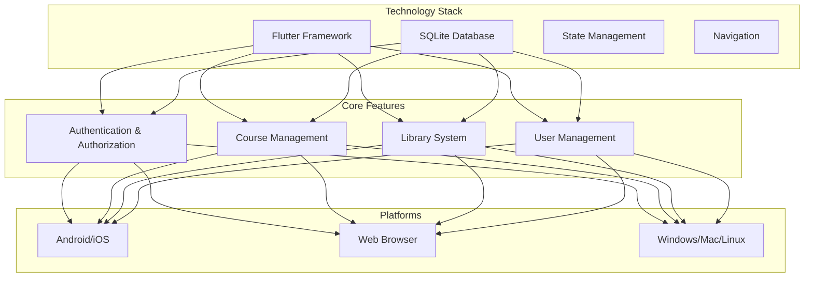
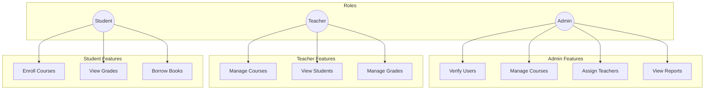
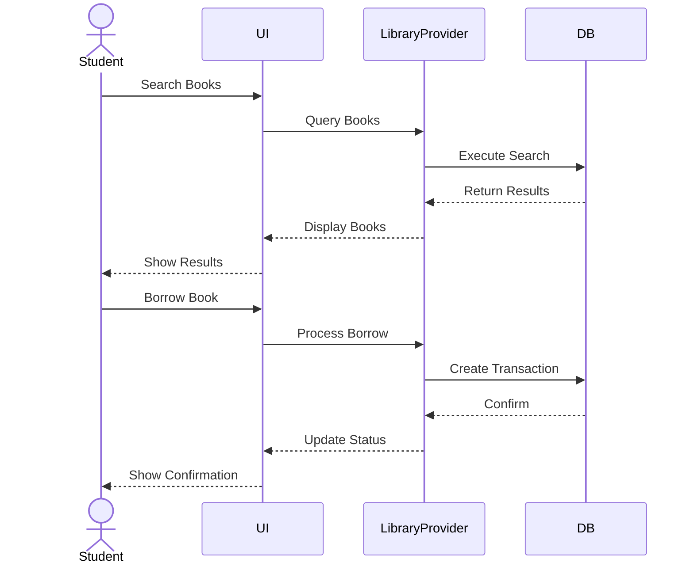
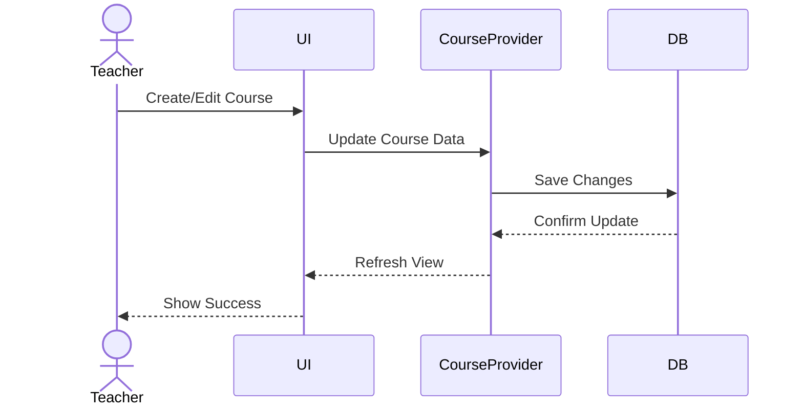
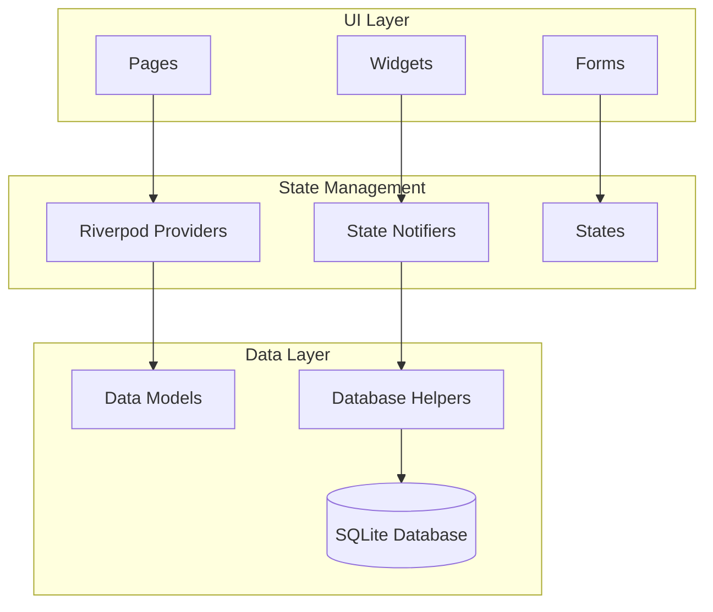
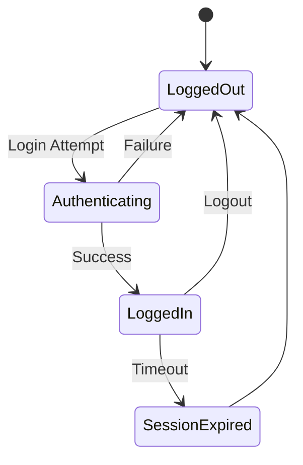

### **1. Title Page**
   - Title of the Project
   - Course Name: Database Application Development
   - Instructor: Mrs. Wen Dawei
   - Student Shanto Md Sohanuzzaman,Spring 2022, CST, School of International Education
   - Submission Date: 2024-11-23

---

### **2. Abstract**
   
This report presents the development and implementation of a Campus Portal System, completed as part of the Database Application Development course under Professor Wen Dawei's supervision at Wuhan Institute of Technology. The project demonstrates the practical application of database concepts through a comprehensive cross-platform solution built using Flutter and SQLite.

The system implements a sophisticated academic management platform with three distinct user roles: administrators, teachers, and students. Using SQLite through Flutter's sqflite package, I developed a robust local database system that efficiently manages complex relationships between users, courses, and library resources. The implementation focuses on maintaining data integrity and security while providing a seamless user experience across multiple platforms.

The technical implementation includes:
- A normalized database schema supporting 8 interconnected tables
- ACID-compliant transaction management for critical operations
- Optimized query performance through strategic indexing
- Secure user authentication and role-based access control
- Real-time state management using Riverpod
- Cross-platform compatibility (Android, iOS, Web, Desktop)

Through this project, I successfully demonstrated practical database implementation skills while creating a useful tool for academic environment management. The system handles essential educational workflows including user verification, course management, library operations, and academic record keeping. This implementation serves as a practical demonstration of the database concepts learned throughout the course, from schema design to query optimization and transaction management.

Keywords: SQLite, Flutter, Database Design, Cross-Platform Development, Academic Management System

### **2.1 Executive Summary**


*Figure 1: System Architecture Overview*

**Project Statistics:**
- 8 Database Tables
- 3 User Roles (Admin, Teacher, Student)
- 4 Core Modules
- Cross-platform Support

**Key Technologies:**
- Flutter & SQLite
- Riverpod State Management
- Material Design 3
- go_router Navigation

---

### **3. Introduction**

#### 3.1 Project Overview
For my Database Application Development course project, under Professor Wen Dawei's guidance, I developed a comprehensive Campus Portal System. This project represents my practical implementation of database concepts through a cross-platform application that serves as a unified platform for academic management. The system demonstrates both database design principles and real-world application development skills.

#### 3.2 Motivation
I chose to develop a campus portal system for several compelling reasons:
- The need for a comprehensive academic management solution that could handle complex database relationships
- The opportunity to implement role-based access control with different user types (admin, teacher, student)
- The challenge of managing concurrent database operations in an educational setting
- The practical value of creating a tool that could potentially benefit academic institutions

#### 3.3 Project Goals
My primary objectives for this project were:
1. **Database Implementation**
   - Design and implement a normalized SQLite database structure
   - Create efficient relationships between different data entities
   - Ensure data integrity through proper constraints and transactions

2. **Application Development**
   - Build a cross-platform application using Flutter
   - Implement role-based access control
   - Create an intuitive user interface for different user types

3. **Technical Learning**
   - Apply database concepts learned in class
   - Gain hands-on experience with transaction management
   - Practice query optimization techniques
   - Understand real-world database application challenges

#### 3.4 Technology Stack
After careful consideration, I selected the following technologies:

1. **Core Technologies**
   - **Database**: SQLite3 via sqflite package
   - **Framework**: Flutter for cross-platform development
   - **State Management**: Riverpod
   - **Navigation**: go_router
   - **UI Design**: Material Design 3

2. **Development Tools**
   - **IDE**: Android Studio
   - **Version Control**: Git
   - **Testing**: Flutter Test Framework
   - **Documentation**: Markdown with UML diagrams

#### 3.5 Project Scope
The implemented system includes:
- User authentication and authorization
- Course management system
- Library management system
- Student enrollment functionality
- Academic record keeping
- Support for multiple platforms (Android, iOS, Web, Desktop)

Through this project, I aimed to create not just a theoretical demonstration but a practical, working system that showcases the database concepts learned throughout Professor Wen Dawei's course. The following sections will detail the technical implementation, challenges faced, and solutions developed during this journey.

---

### **4. System Design**

#### 4.1 Functional Requirements
Based on my analysis of academic management needs, I implemented these key functional requirements:

1. **User Management**
   - User registration and authentication
   - Role-based access control (Admin, Teacher, Student)
   - User profile management
   - User verification system for new registrations

2. **Academic Management**
   - Course creation and management
   - Student enrollment in courses
   - Major/Department organization
   - Academic schedule management
   - Grade recording and tracking

3. **Library System**
   - Book catalog management
   - Book borrowing and returns
   - Search and filter functionality
   - Borrowing history tracking

4. **Administrative Functions**
   - User verification workflow
   - Course assignment to teachers
   - Student enrollment approval
   - System monitoring and management

5. **Reporting and Analytics**
   - Course enrollment statistics
   - Library usage reports
   - User activity tracking
   - Academic performance metrics

#### 4.2 Non-Functional Requirements
To ensure system quality and reliability, I focused on these non-functional requirements:

1. **Performance**
   - Database query response time under 500ms
   - Concurrent user support up to 100 users
   - Efficient data caching mechanisms
   - Optimized database indexing

2. **Security**
   - Secure user authentication
   - Role-based access control
   - Data encryption for sensitive information
   - SQL injection prevention
   - Session management

3. **Reliability**
   - ACID compliance for all transactions
   - Data backup and recovery mechanisms
   - Error handling and logging
   - Transaction rollback support

4. **Usability**
   - Intuitive user interface
   - Responsive design for all screen sizes
   - Cross-platform compatibility
   - Offline data access capability

5. **Maintainability**
   - Modular code architecture
   - Comprehensive documentation
   - Version control integration
   - Database migration support

#### 4.3 Use Case Diagrams

1. **Role-Based Access Control**


2. **Library System Flow**


3. **Course Management Flow**


---

### **5. Implementation**

#### 5.1 Application Overview

In implementing the Campus Portal System, I developed a comprehensive application architecture that integrates Flutter's UI capabilities with SQLite database operations. Here's how the system works:

##### 5.1.1 Architecture Overview


##### 5.1.2 User Interface Implementation
I organized the UI into several key sections:

1. **Authentication Screens**
   
   *Figure 5.1: Login interface with role-based authentication*

   
   *Figure 5.2: User registration with role selection*

2. **Role-Based Dashboards**
   
   *Figure 5.3: Admin dashboard showing user verification and system management*

   
   *Figure 5.4: Teacher's course and student management interface*

   
   *Figure 5.5: Student's course enrollment and library access view*

3. **Core Features**
   
   *Figure 5.6: Course creation and management interface*

   
   *Figure 5.7: Library management with book catalog and borrowing*

   
   *Figure 5.8: User profile and settings management*

4. **Responsive Design**
   
   *Figure 5.9: Application interface on mobile devices*

   
   *Figure 5.10: Application interface on desktop platforms*

   
   *Figure 5.11: Application interface on tablet devices*

##### 5.1.3 Database Integration
I implemented database operations through several specialized helpers:

```dart
// Example of Database Helper Implementation
class DatabaseHelper {
  static final DatabaseHelper instance = DatabaseHelper._init();
  static Database? _database;

  Future<Database> get database async {
    if (_database != null) return _database!;
    _database = await _initDB('campus_portal.db');
    return _database!;
  }

  Future<Database> _initDB(String filePath) async {
    final path = await getDatabasesPath();
    final dbPath = join(path, filePath);
    return await openDatabase(
      dbPath,
      version: 1,
      onCreate: _createDB,
    );
  }
}
```

##### 5.1.4 State Management
I used Riverpod for state management, implementing:

1. **Authentication State**
```dart
final authNotifierProvider = StateNotifierProvider<AuthNotifier, User?>((ref) {
  return AuthNotifier();
});
```

2. **Data Providers**
```dart
final coursesProvider = FutureProvider<List<Course>>((ref) async {
  final db = await DatabaseHelper.instance.database;
  // Query implementation
});
```

##### 5.1.5 Navigation Flow
The application uses go_router for navigation:



##### 5.1.6 Cross-Platform Support
I ensured the application works seamlessly across:
- Mobile (Android, iOS)
- Web browsers
- Desktop (Windows, macOS, Linux)

Through responsive design and platform-specific adaptations:
```dart
ResponsiveBreakpoints.builder(
  child: MaterialApp.router(
    routerConfig: router,
    theme: lightTheme,
    darkTheme: darkTheme,
    themeMode: themeMode,
  ),
  breakpoints: [
    const Breakpoint(start: 0, end: 450, name: MOBILE),
    const Breakpoint(start: 451, end: 800, name: TABLET),
    const Breakpoint(start: 801, end: 1920, name: DESKTOP),
    const Breakpoint(start: 1921, end: double.infinity, name: '4K'),
  ],
)
```

This implementation approach allowed me to create a robust, maintainable system that effectively demonstrates the database concepts learned in the course while providing a practical solution for academic management.

[Next sections continue...]

---

### **6. Advanced Database Concepts**
   - **6.1 Concurrency Control**
     - Explanation of techniques (e.g., locking, timestamp ordering) used to ensure consistency when multiple users interact with the database.
     - How these are implemented or relevant in your project.
   - **6.2 Transactions**
     - ACID properties and their application in your app.
   - **6.3 Indexing**
     - How indexing improves database performance in your project.

---

### **7. Challenges and Solutions**
   - Technical challenges faced during the project.
   - How they were resolved, particularly in terms of database design and functionality.

---

### **8. Testing**
   - Description of the testing process for the database and app.
   - Results of tests for queries, data consistency, and concurrency.

---

### **9. Future Work**
   - Potential improvements or features to add.
   - Scaling the database for more users or additional functionality.

---

### **10. Conclusion**
   - Summarize the significance of the project.
   - Key takeaways regarding database application development.

---

### **11. References**
   - List of all references used for database concepts, frameworks, and tools.

---

### **Appendices (Optional)**
   - Detailed code snippets (e.g., SQL scripts, algorithms).
   - Additional diagrams or screenshots.

---

